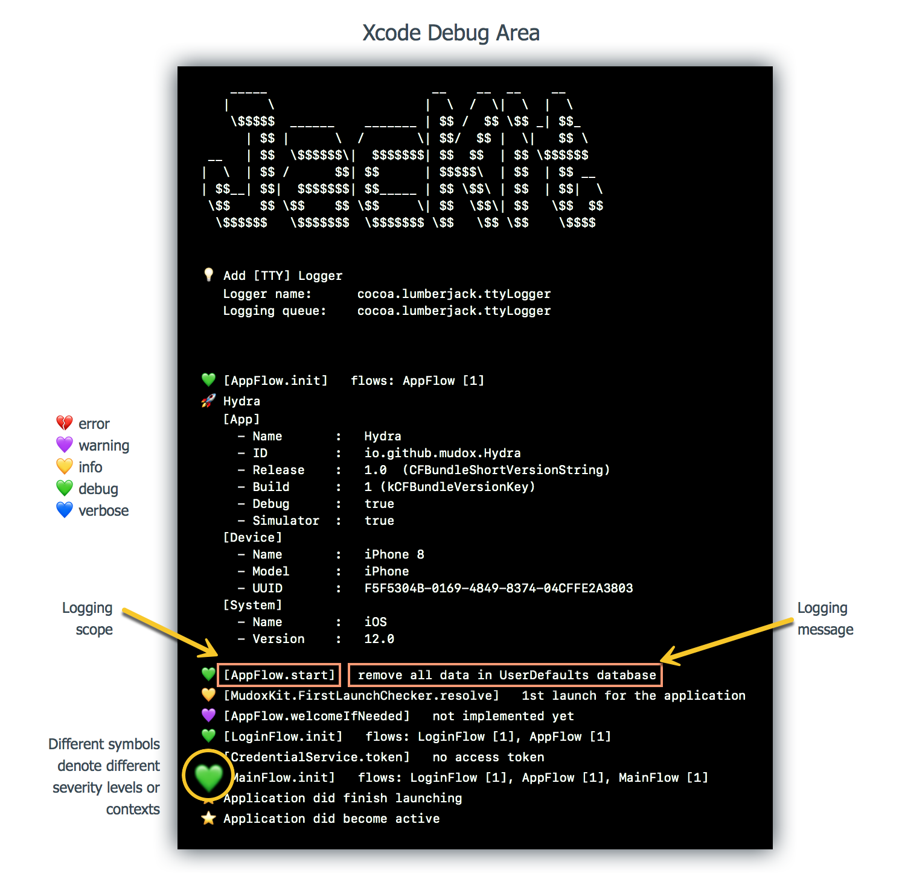

# JacKit


[](https://github.com/mudox/jac-kit/blob/master/LICENSE)
[](https://travis-ci.com/mudox/jac-kit)
[](https://codecov.io/gh/mudox/mudox-kit)
[](https://codeclimate.com/github/mudox/jac-kit/maintainability)

JacKit is a scope based logger inspired from [Python logging module]. It is based on the [CocoaLumberjack] framework.

<p align="center">
  
</p>

## Features

- [x] Modern Swifty interface.
- [x] Scope based logging control.
- [ ] Flexible & eye-saving console output formatting.
    - [x] Common layout options
    - [ ] Merge contiguous logging with the same scope and level.
    - [ ] Significant interval separator.
- [x] HTTP logger to make logging available outside Xcode.

## Installation

<!--JacKit is available through [CocoaPods](http://cocoapods.org). To install-->
<!--it, simply add the following line to your Podfile:-->

JacKit is currently not published.

```ruby
pod 'JacKit' :git => 'https://github.com/mudox/jac-kit.git'
```

## Usage

```swift
// NetworkService.swift

import JacKit

private let jack = Jack("MyApp.NetworkService")
  .set(level: .warning)      // set severity level at upper scope
  .set(options: .short)      // set formatting optoins at upper scope

class NetworkService {

  func request() {
    jack
      .descendant("request") // sub-scope "MyApp.NetworkService.request"
      .info("request ...")   // message with severity level `.info`
  }

}
```

### Scope based logging

A __scope__ is a string using [reverse-DNS] notation you use to represent
arbitrary components in your project. For example:

```swift
// A method named `request` of class `NetworkService`.
MyApp.NetworkService.request

// A class `MainViewController` in your App project.
MyApp.MainViewController

// A method under from your framework project.
MyFramework.Component1.Class2.method3
```

Here

- `MyFramework.Component1` is an **ancestor** of `MyFramework.Component1.Class2.method3`
- `MyApp.NetworkService.request` is a **descendant** of `MyApp`.

Descendants inherit scoped based behaviors from its nearest ancestor who have
corresponding behavior set. You can explicitly set behaviors on a given
descendant to override those inherited behaviors from upstream.

Each `Jack` instance is associated to a given scope when initialized.

Each `Jack` instance expose 2 important properties associated with its
scope:

- Severity `level`.
- Formatting `options`.

They are __computed__ properties, values assigned to are stored in a private shared
place indexed by the scope string.

Every time the property value is read, it is resolved under 3 cases:

- Explicitly set on current scope.

  ```swift
  // Scope have its severity level explicitly set to `.info`
  let jack = Jack("A.B.C")
  jack.set(level: .info)
  ```

- Inherit from parent scope.

  ```swift
  // Explicitly set severity level at higher scope.
  Jack("A").set(level: .warning)

  // This scope have its severity level inherited from ancetor "A".
  let jack = Jack("A.B.C")
  jack.debug("...") // This message will not be logged out.
  ```

- Use fallback value if no parent scope have this property set.

  ```swift
  // This scope and all its ancestor have not set the severity level.
  // Hence use the fallback value - `.verbose`
  let jack = Jack("A.B.C")
  jack.debug("...") // `.debug` is higher than the fallback level `.verbose`, messge get logged out.
  ```

## Author

Mudox

## License

JacKit is available under the MIT license. See the LICENSE file for more info.

[CocoaLumberjack]: https://cocoalumberjack.github.io
[Python logging module]: https://docs.python.org/3/library/logging.html
[reverse-DNS]: https://en.wikipedia.org/wiki/Reverse_domain_name_notation
